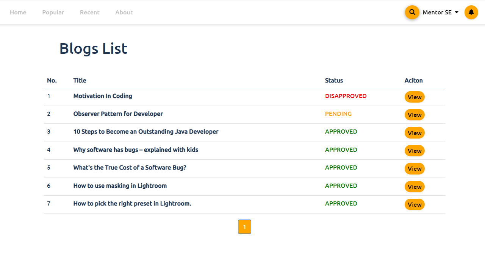
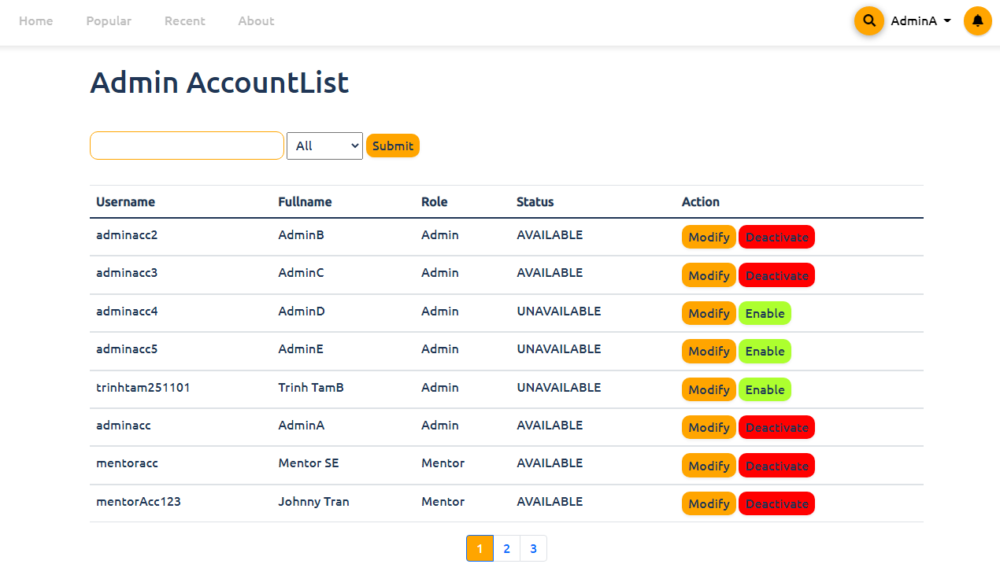

# Academic Blog System

- This is a website that helps college students improve their education and knowledge by reading or contributing articles moderated by professional mentors.
- Heroku: https://academyblog.herokuapp.com/ 

# Team

- Our team consists of 4 peoples:
	- Front-end
		- [Trần Nhĩ Hào](https://github.com/CaptainNemoTNH)
	- Back-end
		- [Trần Đăng Khoa](https://github.com/Johnnymc2001)
		- [Nguyễn Nam Hoàng Long](https://github.com/MaruLd)
		- [Trịnh Tâm](https://github.com/GemBlue071001)

# Technology
- Front-end : Bootstrap, Swiper.js
- Back-end : Java
- Database :
	- Data : MSSQL
	- Image : Cloudinary

# Function
- System contains 4 kind of users type : Guest, Student, Mentor and Admin

- Some main function

| Function        | Guest | Student | Mentor | Admin |
| --------------- | ----- | ------- | ------ | ----- |
| Authentication  | X     | X       | X      | X     | 
| Create Blog     |       | X       | X      |       |
| Edit Blog       |       | X       | X      |       |
| Supervise Blog  |       |         | X      |       |
| Manage System   |       |         |        | X     |

# Implementation

## Login Page

## Register Page

## Home Page

## Search Blog

## View a Blog

## Comment and Rating

## Create/Edit a Blog

## Moderate Blog

## View profile with user information and blogs

## View own blog list and status

